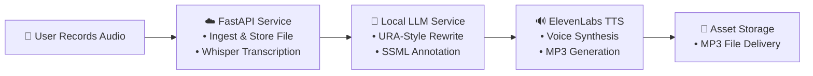
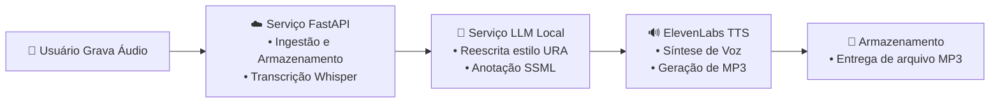

# Voice-to-URA Pipeline

A turnkey solution for **health insurance IVR (URA)** environments that transforms stakeholder-recorded audio into fully annotated, production-ready voice prompts. This README serves as a concise executive overview, detailing the high-level architecture, core components, and deployment flow.

## 📐 Architecture Overview

Below is a visual representation illustrating each processing stage along the pipeline. It conveys the end-to-end orchestration from user input to final IVR deployment.



## 🏗️ Component Breakdown

### FastAPI Ingestion & STT

**Role**: Capture uploaded audio; invoke faster-whisper for transcription.

**Benefit**: Low-latency, on-prem transcripts; metadata persisted for audit and looping.

### Local LLM URA Annotation

**Role**: Utilize on-host Mistral model to rewrite free-form text into concise, segmented URA-style prompts, embedding SSML markup using instructions from `mistral-prompt-template.txt`.

**Benefit**: Full control over prosody, pacing, and brand voice consistency.

### ElevenLabs TTS Rendering

**Role**: High-fidelity mp3/wav synthesis using pt-BR-optimized voice (Antoni / ErXwobaYiN019PkySvjV) and eleven_multilingual_v1.

**Benefit**: Professional sound quality, minimal accent artifacts, and scalable API usage.

### Asset Storage & Delivery

**Role**: Provide immediate access to generated audio files with unique request IDs.

**Benefit**: Instantaneous delivery of new prompts without studio re-recording.

## 🚀 Key Advantages

- **End-to-End Automation**: Automates the entire URA voice-prep cycle in a single service.
- **Cost Efficiency**: Leverages local inference for transcription and rewriting; a single TTS API call per prompt.
- **Simplified Architecture**: No external orchestration tools required, reducing complexity and points of failure.
- **Brand Integrity**: Centralizes voice-persona management, ensuring consistent tone and cadence across campaigns.

## 🛠️ Deployment & Integration

### Simplified Installation (Recommended)

The fastest way to get started is with the automated installation script:

```bash
# For production (default)
./setup-docker.sh
```

This comprehensive script will:
1. Check and install necessary dependencies (Docker, Docker Compose)
2. Configure environment variables
3. Download the Mistral model automatically if needed
4. Start the containers and get everything ready to use

### Manual Installation

If you prefer to install manually, follow these steps:

1. **Clone the Repository**
   ```bash
   git clone git@github.com:your-org/voice-to-ura.git && cd voice-to-ura
   ```

2. **Configure Environment Variables**
   ```bash
   cp env.example .env
   # Edit the .env file to add your ElevenLabs API key
   nano .env
   ```

3. **Download the Mistral Model**
   ```bash
   # Create the models directory and download the model
   mkdir -p models
   curl -L https://huggingface.co/TheBloke/Mistral-7B-Instruct-v0.1-GGUF/resolve/main/mistral-7b-instruct-v0.1.Q4_K_M.gguf -o models/mistral-7b-instruct-v0.1.Q4_K_M.gguf
   ```

4. **Start the System with Docker Compose**
   ```bash
   docker compose up -d
   ```

### Development

For development with hot-reload, run:

```bash
./setup-docker.sh --dev
```

This will start the system using the configuration that enables hot-reload for the backend code and mounts the development directories.

### Web Interface Access

Open http://localhost:8080 to use the Voice-to-URA Pipeline.

### Useful Commands

- **View service logs**: `docker compose logs -f`
- **Stop the service**: `docker compose down`
- **Restart the service**: `docker compose restart`

### Recording and Generating URA Prompts

Use the web interface to record audio, view URA-style formatting, and generate professional voice prompts.

---

Powered by FastAPI • Whisper • Local LLM • ElevenLabs  
Designed for Amil Health Insurance — rapid iteration, zero-studio dependency.

---

# Pipeline Voz-para-URA

Uma solução completa para ambientes de **URA (IVR) de planos de saúde** que transforma áudio gravado por stakeholders em prompts de voz totalmente anotados e prontos para produção. Este README serve como uma visão executiva concisa, detalhando a arquitetura de alto nível, componentes principais e fluxo de implantação.

## 📐 Visão Geral da Arquitetura

Abaixo está uma representação visual ilustrando cada estágio de processamento ao longo do pipeline. Ela transmite a orquestração de ponta a ponta, desde a entrada do usuário até a implantação final na URA.



## 🏗️ Detalhamento dos Componentes

### Ingestão FastAPI e STT

**Função**: Capturar áudio enviado; invocar faster-whisper para transcrição.

**Benefício**: Transcrições locais de baixa latência; metadados persistidos para auditoria e processamento.

### Anotação URA com LLM Local

**Função**: Utilizar o modelo Mistral hospedado localmente para reescrever texto livre em prompts concisos e segmentados no estilo URA, incorporando marcação SSML usando instruções do `mistral-prompt-template.txt`.

**Benefício**: Controle total sobre prosódia, ritmo e consistência da voz da marca.

### Renderização TTS com ElevenLabs

**Função**: Síntese de mp3/wav de alta fidelidade usando voz otimizada para pt-BR (Antoni / ErXwobaYiN019PkySvjV) e eleven_multilingual_v1.

**Benefício**: Qualidade de som profissional, mínimo de artefatos de sotaque e uso escalável da API.

### Armazenamento e Entrega de Ativos

**Função**: Fornecer acesso imediato aos arquivos de áudio gerados com IDs de requisição únicos.

**Benefício**: Entrega instantânea de novos prompts sem necessidade de regravação em estúdio.

## 🚀 Vantagens Principais

- **Automação Completa**: Automatiza todo o ciclo de preparação de voz para URA em um único serviço.
- **Eficiência de Custos**: Aproveita inferência local para transcrição e reescrita; uma única chamada de API TTS por prompt.
- **Arquitetura Simplificada**: Não requer ferramentas externas de orquestração, reduzindo complexidade e pontos de falha.
- **Integridade da Marca**: Centraliza o gerenciamento da persona de voz, garantindo tom e cadência consistentes em todas as campanhas.

## 🛠️ Implantação e Integração

### Instalação Simplificada (Recomendada)

O modo mais rápido de começar é com o script de instalação automatizado:

```bash
# Para produção (padrão)
./setup-docker.sh
```

Este script completo vai:
1. Verificar e instalar as dependências necessárias (Docker, Docker Compose)
2. Configurar as variáveis de ambiente
3. Baixar o modelo Mistral automaticamente se necessário
4. Iniciar os containers e deixar tudo pronto para uso

### Instalação Manual

Se preferir fazer a instalação manualmente, siga estes passos:

1. **Clone o Repositório**
   ```bash
   git clone git@github.com:your-org/voice-to-ura.git && cd voice-to-ura
   ```

2. **Configure Variáveis de Ambiente**
   ```bash
   cp env.example .env
   # Edite o arquivo .env para adicionar sua chave de API do ElevenLabs
   nano .env
   ```

3. **Baixe o Modelo Mistral**
   ```bash
   # Crie o diretório models e baixe o modelo
   mkdir -p models
   curl -L https://huggingface.co/TheBloke/Mistral-7B-Instruct-v0.1-GGUF/resolve/main/mistral-7b-instruct-v0.1.Q4_K_M.gguf -o models/mistral-7b-instruct-v0.1.Q4_K_M.gguf
   ```

4. **Inicie o Sistema com Docker Compose**
   ```bash
   docker compose up -d
   ```

### Desenvolvimento

Para desenvolvimento com hot-reload, execute:

```bash
./setup-docker.sh --dev
```

Isso iniciará o sistema com configuração que habilita hot-reload para o código backend e monta os diretórios de desenvolvimento.

### Acesso à Interface Web

Abra http://localhost:8080 para usar o Pipeline Voz-para-URA.

### Comandos Úteis

- **Ver logs do serviço**: `docker compose logs -f`
- **Parar o serviço**: `docker compose down`
- **Reiniciar o serviço**: `docker compose restart`

### Gravar e Gerar Prompts URA

Use a interface web para gravar áudio, visualizar a formatação no estilo URA e gerar prompts de voz profissionais.

---

Desenvolvido com FastAPI • Whisper • LLM Local • ElevenLabs  
Projetado para Amil Seguros de Saúde — iteração rápida, zero dependência de estúdio.