# Voice-to-URA Pipeline

A turnkey solution for **health insurance IVR (URA)** environments that transforms stakeholder-recorded audio into fully annotated, production-ready voice prompts. This README serves as a concise executive overview, detailing the high-level architecture, core components, and deployment flow.

---

## 📐 Architecture Overview

Below is a visual representation illustrating each processing stage along the pipeline. It conveys the end-to-end orchestration from user input to final IVR deployment.

```mermaid
flowchart LR
  A[🎤 User Records Audio] --> B[☁️ FastAPI Service<br/>• Ingest & Store File<br/>• Whisper Transcription]
  B --> C[🤖 Local LLM Service<br/>• URA-Style Rewrite<br/>• SSML Annotation]
  C --> D[🔊 ElevenLabs TTS<br/>• Voice Synthesis<br/>• MP3 Generation]
  D --> E[💾 Asset Storage<br/>• MP3 File Delivery]
```



## 🏗️ Component Breakdown

### FastAPI Ingestion & STT

**Role**: Capture uploaded audio; invoke faster-whisper for transcription.

**Benefit**: Low-latency, on-prem transcripts; metadata persisted for audit and looping.

### Local LLM URA Annotation

**Role**: Utilize an on-host model (Mistral-instruct or Phi-2) to rewrite free-form text into concise, segmented URA-style prompts, embedding SSML `<break>` tags.

**Benefit**: Full control over prosody, pacing, and brand voice consistency.

### ElevenLabs TTS Rendering

**Role**: High-fidelity mp3/wav synthesis using pt-BR-optimized voice (Bella / 21m00Tcm4TlvDq8ikWAM) and eleven_multilingual_v1.

**Benefit**: Professional sound quality, minimal accent artifacts, and scalable API usage.

### Asset Storage & Delivery

**Role**: Provide immediate access to generated audio files with unique request IDs.

**Benefit**: Instantaneous delivery of new prompts without studio re-recording.

## 🚀 Key Advantages

- **End-to-End Automation**: Automates the entire URA voice-prep cycle in a single service.
- **Cost Efficiency**: Leverages local inference for transcription and rewriting; a single TTS API call per prompt.
- **Simplified Architecture**: No external orchestration tools required, reducing complexity and points of failure.
- **Brand Integrity**: Centralizes voice-persona management, ensuring consistent tone and cadence across campaigns.

## 🛠️ Deployment & Integration

### Quick Start (Single Docker Command)

The fastest way to get started is with this one-line Docker command:

```bash
./run-ura-pipeline.sh
```

This script will:
1. Check for the ElevenLabs API key
2. Build the Docker image
3. Run the container with all necessary configurations

### Manual Setup

1. **Clone Repository**
   ```bash
   git clone git@github.com:your-org/voice-to-ura.git && cd voice-to-ura
   ```

2. **Environment Variables**
   ```bash
   export ELEVENLABS_API_KEY=your_key_here
   ```

3. **Build and Run the Docker Container**
   ```bash
   docker build -t voice-to-ura:latest -f Dockerfile.ura-pipeline .
   docker run -d -p 8000:8000 -e ELEVENLABS_API_KEY=$ELEVENLABS_API_KEY --name ura-pipeline voice-to-ura:latest
   ```

4. **Access the Web Interface**
   
   Open http://localhost:8000 to use the Voice-to-URA Pipeline.

5. **Record & Generate URA Prompts**
   
   Use the web interface to record audio, preview the URA-style formatting, and generate professional voice prompts.

---

Powered by FastAPI • Whisper • Local LLM • ElevenLabs  
Designed for Amil Health Insurance — rapid iteration, zero-studio dependency.